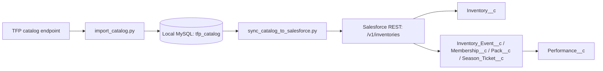

# Local catalog → Salesforce sync

The local integration connects the TFP catalog, the normalized MySQL database, and the existing Salesforce inventory API without exposing MySQL to the internet.



The join key remains `products[].id = Inventory__c.Inventory_Id__c`. The Salesforce endpoint performs an external-ID upsert, so rerunning the sync updates existing inventories instead of creating duplicates. Its current Apex logic also refreshes the typed child and performance records.

SecuTix occasionally reuses one product ID in overlapping seasons. Because Salesforce permits only one `Inventory__c` row for that external ID, the bridge deterministically sends the payload from the season with the latest start date. The dry-run summary reports both the season-scoped row count and the resulting unique product count.

In the full catalog export, season membership is expressed by nesting a product under `seasons[]`; the individual product object does not always repeat `seasonId`. The bridge adds that relational key to the outbound webhook payload so `Inventory__c.Season_Id__c` is populated.

## Safety

- Every REST request is executed through the authenticated Salesforce CLI; no access token is exported or saved by the bridge.
- The project's configured target is `TFA UAT` in `.sf/config.json`.
- The script refuses production writes unless `--allow-production` is supplied explicitly.
- MySQL remains bound locally and is never called from Salesforce Cloud.

## Commands

Run these commands from the Salesforce project root.

Validate the current MySQL snapshot and Salesforce authentication without changing Salesforce:

```powershell
python scripts/catalog/sync_catalog_to_salesforce.py --check-auth
```

Refresh MySQL from the web catalog and validate the resulting Salesforce batches, without changing Salesforce:

```powershell
python scripts/catalog/refresh_and_sync.py
```

Refresh MySQL and upsert the complete latest snapshot to UAT:

```powershell
python scripts/catalog/refresh_and_sync.py --execute
```

Verify that every latest-snapshot inventory and typed child count matches UAT:

```powershell
python scripts/catalog/verify_catalog_sync.py
```

For a small UAT verification, sync one product from the already-imported snapshot:

```powershell
python scripts/catalog/sync_catalog_to_salesforce.py --execute --product-id 10228687124782
```

Production remains an intentional separate operation:

```powershell
python scripts/catalog/sync_catalog_to_salesforce.py --execute --target-org "TFA Prod" --allow-production
```

Use production only after reviewing the UAT result. The sync is idempotent for `Inventory__c`, but the existing Apex service intentionally deletes and rebuilds a product's `Performance__c` children on every update.

## Verified UAT result — 2026-08-06

Snapshot `9` contained 166 season-scoped product rows and 164 unique external product IDs. The complete UAT sync accepted all 164 products. The relationship audit matched the outbound catalog exactly: 164 inventories, 112 inventory events, 984 performances, 2 memberships, 50 season tickets, 0 packs, and 0 inventories missing `Season_Id__c`.

The Salesforce performance count is intentionally 19 lower than the 1,003 season-scoped MySQL rows: two external product IDs occur in both overlapping seasons, and Salesforce's unique `Inventory_Id__c` retains only each product's newest-season payload.

## Ongoing catalog enrichment

The first load continues to use the local MySQL bridge above. After an inventory is inserted or updated, `InventoryRestResource` asks `CatalogEnrichmentQueueable` to enrich its product ID only when the org configuration is enabled. Calls are split into groups of at most 50 IDs, matching the provider limit, and additional groups are chained as separate queueable jobs.

The provider response is handled by `CatalogEnrichmentService`. It updates the matching `Inventory__c`, its `Inventory_Event__c`, and existing `Performance__c` records. It never creates a replacement inventory and does not delete data when the provider returns `found: false`; instead, it records `Not Found` and the provider note in the enrichment status fields. Request and response summaries are written to `Integration_Log__c`.

Season Ticket Subjects and Lines are relational Salesforce records:

```text
Inventory__c
  -> Season_Ticket__c
       -> Season_Ticket_Subject__c
       -> Season_Ticket_Line__c
            -> Season_Ticket_Subject__c (when placementType = subject)
            -> Inventory__c (the target product)
```

The initial `/v1/inventories` bootstrap always processes these collections from the full MySQL catalog. `CatalogEnrichmentService` uses the same relationship service when an enrichment product contains a `seasonTicket` object with `seasonTicketSubjects` or `seasonTicketLines`. The provider response example supplied by email does not show `seasonTicket`, so this must be confirmed with the provider before assuming the ongoing resolve API will refresh these relationships.

An authenticated bootstrap or replay can post the exact provider response envelope to:

```text
/services/apexrest/v1/catalog-enrichment
```

The payload must contain a top-level `order` array. The `started` and `excectution` properties are accepted but ignored by the mapper.

### Activation checklist

The UAT implementation is deliberately inactive until the provider supplies the real resolve endpoint and authentication details.

1. In UAT Setup, create an External Credential and a Named Credential for the provider. Do not store a password, token, or API key in this repository.
2. Assign the `TFP Catalog Enrichment` permission set to every Salesforce user that needs to inspect the fields or invoke the inbound endpoint.
3. Create the hierarchy custom-setting org default in **Setup → Custom Settings → Catalog Enrichment Setting → Manage**:
   - `Enabled`: leave unchecked for the first test.
   - `Named Credential`: the Named Credential developer name, without `callout:`.
   - `Endpoint Path`: the provider's resolve path, for example `/catalog/products/resolve`.
   - `Timeout Milliseconds`: `120000`.
4. Run one product manually in Execute Anonymous, replacing the ID with an active UAT inventory ID:

```apex
System.enqueueJob(new CatalogEnrichmentQueueable(
    new List<Long>{ 10228689876617L },
    false
));
```

5. Confirm a successful `Integration_Log__c` entry and verify the Inventory, Inventory Event, and Performance enrichment fields.
6. Check `Enabled` only after the one-product test succeeds. From then on, the inventory webhook automatically enqueues enrichment.
7. Optionally schedule retries for records that are not enriched or are older than 20 hours:

```apex
System.schedule(
    'TFP Catalog Enrichment Nightly',
    '0 15 2 * * ?',
    new CatalogEnrichmentRetryScheduler()
);
```

Use `forceRefresh = true` only for a deliberate manual run. Normal webhook and scheduled calls use the provider's nightly cache.

### UAT smoke test — 2026-08-06

Deployment `0AfMA00000CVqcv0AD` installed the Apex, fields, custom setting, and layout with 11 passing tests. Permission-set deployment `0AfMA00000CVqhl0AD` exposed the new fields to the UAT user. A real authenticated POST to `/services/apexrest/v1/catalog-enrichment` processed one inventory, one inventory event, and one performance with zero errors. No outbound provider request was made because the custom setting has no enabled org-default record.

Deployment `0AfMA00000CVql00AD` added the relational Season Ticket Subject and Line model with 13 passing tests. Replaying MySQL snapshot `9` produced 50 Season Tickets, 8 Subjects, and 2,182 Lines in UAT. Every subject-placed Line has its Subject lookup, and every Line has its target Inventory lookup.
